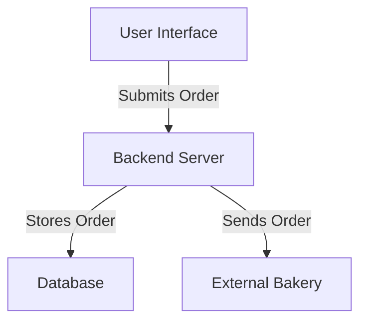

# Memory Bank for the Lunch Ordering System

## General Overview
The Lunch Ordering System is designed for internal use within the company, allowing employees to place lunch orders easily. The system will enable a few users to manage the menu while allowing all employees to place their orders daily.

## Installation Instructions
1. Clone the repository:
   ```bash
   git clone <repository-url>
   ```
2. Navigate to the project directory:
   ```bash
   cd LunchOrderingSystem
   ```
3. Install dependencies:
   ```bash
   # For .NET projects
   dotnet restore
   ```

## Usage
1. Run the application:
   ```bash
   dotnet run
   ```
2. Open your browser and navigate to `http://localhost:5000` to access the application.

## Contributing
Contributions are welcome! Please submit a pull request or open an issue for any suggestions or improvements.

## License
This project is licensed under the MIT License.

## Order Data Structure
The order object will contain the following fields:

- **employeeName**: String - The name of the employee placing the order.
- **mealType**: String - The type of meal selected (e.g., "sandwich" or "salad").
- **breadType**: String (optional) - The type of bread selected (e.g., "brown" or "white"). This field is only applicable if the meal type is "sandwich".
- **kind**: Array of Strings (optional) - The selected kind values for the sandwich. This field is only applicable if the meal type is "sandwich".

## Example Order Object
```json
{
  "employeeName": "John Doe",
  "mealType": "sandwich",
  "breadType": "brown",
  "kind": ["tuna", "egg", "chicken","BLT"]
}
```

## Project Overview
The Lunch Ordering System is designed for internal use within the company, allowing employees to place lunch orders easily. The system will enable a few users to manage the menu while allowing all employees to place their orders daily.

## Requirements
- **Order Collection**: Orders will be collected daily at 10:00 AM and sent to an external bakery.
- **User Input**: Users will provide their name, select either a sandwich or salad, choose between brown or white bread (if a sandwich is selected), and select toppings.
- **Database**: A simple database will be used to persist order data.
- **No User Authentication**: The system will operate without user authentication for simplicity.

## Components
1. **Frontend**: 
   - A user interface for placing orders.
   - Forms for user input (name, meal type, bread type, toppings).

2. **Backend**: 
   - A server to handle incoming requests.
   - Logic for managing the menu and processing orders.

3. **Database**: 
   - A simple database to store user orders and menu items.

## Architecture Diagram


## README
### Overview
The Lunch Ordering System is designed for internal use within the company, allowing employees to place lunch orders easily. The system will enable a few users to manage the menu while allowing all employees to place their orders daily.

### Installation Instructions
1. Clone the repository:
   ```bash
   git clone <repository-url>
   ```
2. Navigate to the project directory:
   ```bash
   cd LunchOrderingSystem
   ```
3. Install dependencies:
   ```bash
   # For .NET projects
   dotnet restore
   ```

### Usage
1. Run the application:
   ```bash
   dotnet run
   ```
2. Open your browser and navigate to `http://localhost:5000` to access the application.

### Contributing
Contributions are welcome! Please submit a pull request or open an issue for any suggestions or improvements.

### License
This project is licensed under the MIT License.
### Actors
- **User**
- **Menu Manager**
- **Backend Server**
- **Database**

### Use Cases
1. **Place an Order**
   - Actor: User
   - Description: User places a lunch order.

2. **Submit an Order**
   - Actor: User
   - Description: User submits the order before the cutoff time.

3. **Manage Menu Items**
   - Actor: Menu Manager
   - Description: Menu Manager adds, edits, or removes menu items.

4. **Receive Order Confirmation**
   - Actor: User
   - Description: User receives confirmation of their order.

5. **Persist Order Data**
   - Actor: Database
   - Description: Database stores all user orders and menu items.

## Use Case Diagram
### Actors
- **User**
- **Menu Manager**
- **Backend Server**
- **Database**

### Use Cases
1. **Place an Order**
   - Actor: User
   - Description: User places a lunch order.

2. **Submit an Order**
   - Actor: User
   - Description: User submits the order before the cutoff time.

3. **Manage Menu Items**
   - Actor: Menu Manager
   - Description: Menu Manager adds, edits, or removes menu items.

4. **Receive Order Confirmation**
   - Actor: User
   - Description: User receives confirmation of their order.

5. **Persist Order Data**
   - Actor: Database
   - Description: Database stores all user orders and menu items.

### Diagram Structure
- User interacts with "Place an Order" and "Submit an Order".
- Menu Manager interacts with "Manage Menu Items".
- Backend Server interacts with "Place an Order" and "Receive Order Confirmation".
- Database interacts with "Persist Order Data".

```mermaid
%%{ init : { "theme" : "default" } }%%
graph TD;
    User -->|Places| PlaceOrder;
    User -->|Submits| SubmitOrder;
    MenuManager -->|Manages| ManageMenuItems;
    User -->|Receives| ReceiveConfirmation;
    Database -->|Stores| PersistOrderData;

    PlaceOrder[Place an Order]
    SubmitOrder[Submit an Order]
    ManageMenuItems[Manage Menu Items]
    ReceiveConfirmation[Receive Order Confirmation]
    PersistOrderData[Persist Order Data]
### Components

#### 1. Order Form
- **Input Fields**:
  - **Employee Name**: Text input for the user's name.
  - **Meal Type**: Dropdown selection (options: "Sandwich", "Salad").
  - **Bread Type** (conditional):
    - Dropdown selection (options: "Brown", "White") - only visible if "Sandwich" is selected.
  - **Kind** (conditional):
    - Checkbox or multi-select dropdown (options: "Tuna", "Egg", "Chicken", "BLT") - only visible if "Sandwich" is selected.

#### 2. Submit Button
- A button to submit the order.

#### 3. Confirmation Message
- A message displayed after successful order submission, showing the order details.

### Layout
- The form should be centered on the page with clear labels for each input field.
- Use responsive design principles to ensure usability on different devices.

### Example UI Flow
1. User opens the order form.
2. User inputs their name.
3. User selects a meal type.
4. If "Sandwich" is selected, additional options for bread type and kind are displayed.
5. User submits the form.
6. Confirmation message is displayed with order details.
### Current Status
- The memory bank has been successfully structured into separate files, including:
  - `project_brief.md`
  - `productContext.md`
  - `activeContext.md`
  - `systemPatterns.md`
  - `techContext.md`
  - `progress.md` (this file)

### Known Issues
- No known issues at this time.

### Evolution of Project Decisions
- The decision to create a Lunch Ordering System was based on the need for a streamlined process for employees to place lunch orders.
- The architecture and design patterns were chosen to ensure efficiency and maintainability of the system.

### Next Steps
- Continue development of the frontend and backend components.
- Implement the database and ensure proper integration with the server.
- Test the order collection and sending process to the external bakery.
### Components

#### 1. Order Form
- **Input Fields**:
  - **Employee Name**: Text input for the user's name.
  - **Meal Type**: Dropdown selection (options: "Sandwich", "Salad").
  - **Bread Type** (conditional):
    - Dropdown selection (options: "Brown", "White") - only visible if "Sandwich" is selected.
  - **Kind** (conditional):
    - Checkbox or multi-select dropdown (options: "Tuna", "Egg", "Chicken", "BLT") - only visible if "Sandwich" is selected.

#### 2. Submit Button
- A button to submit the order.

#### 3. Confirmation Message
- A message displayed after successful order submission, showing the order details.

### Layout
- The form should be centered on the page with clear labels for each input field.
- Use responsive design principles to ensure usability on different devices.

### Example UI Flow
1. User opens the order form.
2. User inputs their name.
3. User selects a meal type.
4. If "Sandwich" is selected, additional options for bread type and kind are displayed.
5. User submits the form.
6. Confirmation message is displayed with order details.
- User interacts with "Place an Order" and "Submit an Order".
- Menu Manager interacts with "Manage Menu Items".
- Backend Server interacts with "Place an Order" and "Receive Order Confirmation".
- Database interacts with "Persist Order Data".

```mermaid
%%{ init : { "theme" : "default" } }%%
graph TD;
    User -->|Places| PlaceOrder;
    User -->|Submits| SubmitOrder;
    MenuManager -->|Manages| ManageMenuItems;
    User -->|Receives| ReceiveConfirmation;
    Database -->|Stores| PersistOrderData;

    PlaceOrder[Place an Order]
    SubmitOrder[Submit an Order]
    ManageMenuItems[Manage Menu Items]
    ReceiveConfirmation[Receive Order Confirmation]
    PersistOrderData[Persist Order Data]
### Components

#### 1. Order Form
- **Input Fields**:
  - **Employee Name**: Text input for the user's name.
  - **Meal Type**: Dropdown selection (options: "Sandwich", "Salad").
  - **Bread Type** (conditional):
    - Dropdown selection (options: "Brown", "White") - only visible if "Sandwich" is selected.
  - **Kind** (conditional):
    - Checkbox or multi-select dropdown (options: "Tuna", "Egg", "Chicken", "BLT") - only visible if "Sandwich" is selected.

#### 2. Submit Button
- A button to submit the order.

#### 3. Confirmation Message
- A message displayed after successful order submission, showing the order details.

### Layout
- The form should be centered on the page with clear labels for each input field.
- Use responsive design principles to ensure usability on different devices.

### Example UI Flow
1. User opens the order form.
2. User inputs their name.
3. User selects a meal type.
4. If "Sandwich" is selected, additional options for bread type and kind are displayed.
5. User submits the form.
6. Confirmation message is displayed with order details.
1. **As an employee**, I want to place a lunch order easily so that I can enjoy my meal without hassle.
   - Acceptance Criteria:
     - The system should allow me to input my name.
     - I should be able to select either a sandwich or salad.
     - If I select a sandwich, I should choose between brown or white bread.
     - I should be able to select toppings for my sandwich.

2. **As a user**, I want to submit my order before the daily cutoff time of 10:00 AM so that my order can be processed and sent to the bakery.
   - Acceptance Criteria:
     - The system should prevent order submissions after 10:00 AM.
     - A confirmation message should be displayed upon successful order submission.

3. **As a menu manager**, I want to manage the menu items so that I can update the available options for employees.
   - Acceptance Criteria:
     - The system should allow me to add, edit, or remove menu items.
     - Changes to the menu should be reflected in the user interface immediately.

4. **As a backend server**, I want to handle incoming requests efficiently so that I can process orders without delays.
   - Acceptance Criteria:
     - The server should accept and process orders from multiple users simultaneously.
     - The server should store order data in the database.

5. **As a database**, I want to persist order data so that it can be retrieved and managed later.
   - Acceptance Criteria:
     - The database should store all user orders and menu items.
     - The data should be retrievable for reporting and analysis.

6. **As a user**, I want to receive a confirmation of my order so that I know it has been successfully placed.
   - Acceptance Criteria:
     - A confirmation message should be displayed after order submission.
     - The confirmation should include the details of my order.
