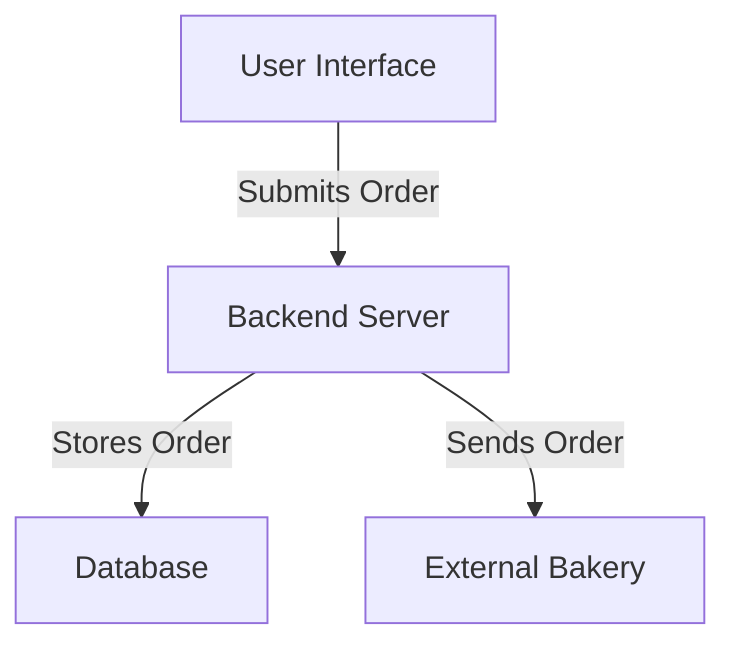

# Lunch Ordering System Project Brief

## Overview
The Lunch Ordering System is designed for internal use within the company, allowing employees to place lunch orders easily. The system will enable a few users to manage the menu while allowing all employees to place their orders daily.

## Requirements
- **Order Collection**: Orders will be collected daily at 10:00 AM and sent to an external bakery.
- **User Input**: Users will provide their name, select either a sandwich or salad, choose between brown or white bread (if a sandwich is selected), and select toppings.
- **Database**: A simple database will be used to persist order data.
- **No User Authentication**: The system will operate without user authentication for simplicity.

## Components
1. **Frontend**: 
   - A user interface for placing orders.
   - Forms for user input (name, meal type, bread type, toppings).

2. **Backend**: 
   - A server to handle incoming requests.
   - Logic for managing the menu and processing orders.

3. **Database**: 
   - A simple database to store user orders and menu items.

## Architecture Diagram

## Next Steps
1. Set up the project structure.
2. Develop the frontend interface.
3. Implement the backend server.
4. Set up the database.
5. Test the order collection and sending process.