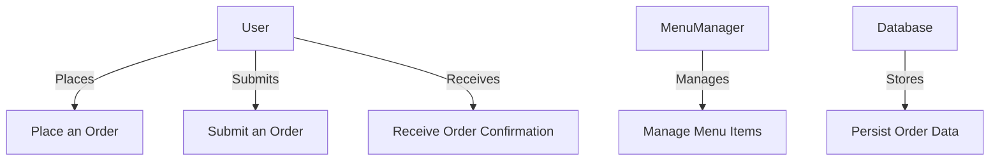

# Use Case Diagram for Lunch Ordering System

## Actors
- **User**
- **Menu Manager**
- **Backend Server**
- **Database**

## Use Cases
1. **Place an Order**
   - Actor: User
   - Description: User places a lunch order.

2. **Submit an Order**
   - Actor: User
   - Description: User submits the order before the cutoff time.

3. **Manage Menu Items**
   - Actor: Menu Manager
   - Description: Menu Manager adds, edits, or removes menu items.

4. **Receive Order Confirmation**
   - Actor: User
   - Description: User receives confirmation of their order.

5. **Persist Order Data**
   - Actor: Database
   - Description: Database stores all user orders and menu items.

## Diagram Structure
- User interacts with "Place an Order" and "Submit an Order".
- Menu Manager interacts with "Manage Menu Items".
- Backend Server interacts with "Place an Order" and "Receive Order Confirmation".
- Database interacts with "Persist Order Data".

This structure can be used to create a visual diagram using tools like Lucidchart, Draw.io, or any other diagramming software.